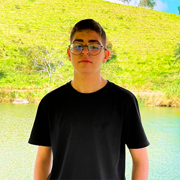

# Repositório público de Pedro Medeiros

## Alguns Projetos:

* [Acesse o Projeto Cordel Moderno aqui](https://pedro-sousaz.github.io/projeto-cordel/)
* [Acesse o Projeto Android aqui](https://pedro-sousaz.github.io/android-projeto/)
* [Acesse o Projeto Social aqui](https://pedro-sousaz.github.io/projeto-social/)
* [Acesse o Projeto Login aqui](https://pedro-sousaz.github.io/projeto-login/)
* [Acesse o meu Portfólio de teste aqui](https://pedro-sousaz.github.io/Portfolio-dois/)
* [Acesse o Projeto Página de viagens](https://pedro-sousaz.github.io/projeto-viagem/)
* [Acesse o Site da Upp](https://pedro-sousaz.github.io/upp/)